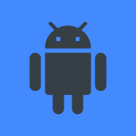

# Progressive Web App - Mobile Game Engine

See working example [here](https://iconejey.github.io/pwa-mge/).

## Project structure example:

```
project
├───index.html
├───style.css
├───main.js
├───img
│    ├───icon192.png
│    └───icon512.png
└───manifest.html
```

## Required for head:

```html
<!-- [Optional] App compatibility and display -->
<meta name="viewport" content="width=device-width, initial-scale=1.0, viewport-fit=cover" />
<meta name="mobile-web-app-capable" content="yes" />
<meta name="apple-mobile-web-app-capable" content="yes" />

<!-- [Optional] Theme color / icon -->
<meta name="theme-color" content="#181818" />
<link rel="shortcut icon" href="/img/icon512.png" type="image/x-icon" />
<link rel="apple-touch-icon" href="./img/icon192.png" />

<!-- [Required] Manifest and stylesheet -->
<link rel="manifest" href="./manifest.json" />
<link rel="stylesheet" href="https://iconejey.github.io/pwa-mge/mge.css" />
<link rel="stylesheet" href="./style.css" />
```

## Required for body:

```html
<!-- [Required] Mobile Game Engine Element -->
<div class="mge-main">
	<!-- [Required] Game canvas -->
	<canvas></canvas>

	<!-- [Required] Sections shown over canvas using mge.setOverlay(id) -->
	<div class="mge-overlay">
		<!-- [Required] Lanscape section -->
		<section id="landscape">
			<p>Over the canvas when screen not held in landscape mode.</p>
		</section>

		<!-- [Required] Fullscreen section -->
		<section id="fullscreen">
			<p>Over the canvas when game not in fullscreen and mge.forceFulscreen is true.<br />Tap on screen to go fullscreen.</p>
		</section>

		<!-- [Optional] Custom section -->
		<section id="example">
			<p>Example of custom overlay.</p>
			<a onclick="mge.setOverlay(null)">[exit]</a>
			
		</section>
	</div>
</div>

<!-- [Optional] Cookie tools -->
<script src="https://iconejey.github.io/pwa-mge/cookie.js"></script>

<!-- [Required] Mobile Game Engine -->
<script src="https://iconejey.github.io/pwa-mge/mge.js"></script>

<!-- [Required] Main script -->
<script src="./main.js"></script>
```

## style.css example use:

```css
/* Style applied to example overlay image */
.mge-overlay #example img {
	border-radius: 20%;
	position: absolute;
	left: 50%;
	top: 50%;
	transform: translate(-50%, -50%);
}

/* Style applied to canvas when the example overlay is shown */
.mge-canvas-on-example-section {
	filter: blur(5px);
}
```

## main.js example use:

```js
// Setting left joystick as fixed with 0.2 min opacity
mge.joysticks.L.fixed = true;
mge.joysticks.L.min_op = 0.2;

// Showing example section on left joystick tap
mge.joysticks.L.onTap = j => mge.setOverlay('example');

// Logic loop
mge.logic = _ => {
	// Setting left joystick position
	mge.joysticks.L.base.x = mge.canvas.width / 6;
	mge.joysticks.L.base.y = (mge.canvas.height * 3) / 4;
};

// Graphics loop
mge.graphics = _ => {
	mge.clear();

	mge.joysticks.L.draw(mge.ctx);
	mge.joysticks.R.draw(mge.ctx);
};

// Main loop
mge.tick(0);
```

## manifest.json example:

```json
{
	"name": "Mobile Game",
	"short_name": "Mobile Game",

	"start_url": "https://mygame.com/",
	"display": "fullscreen",
	"orientation": "landscape",

	"background_color": "white",
	"theme_color": "white",

	"icons": [
		{
			"src": "img/icon192.png",
			"sizes": "192x192",
			"type": "image/png",
			"purpose": "maskable"
		},
		{
			"src": "img/icon512.png",
			"sizes": "512x512",
			"type": "image/png",
			"purpose": "maskable"
		}
	]
}
```
